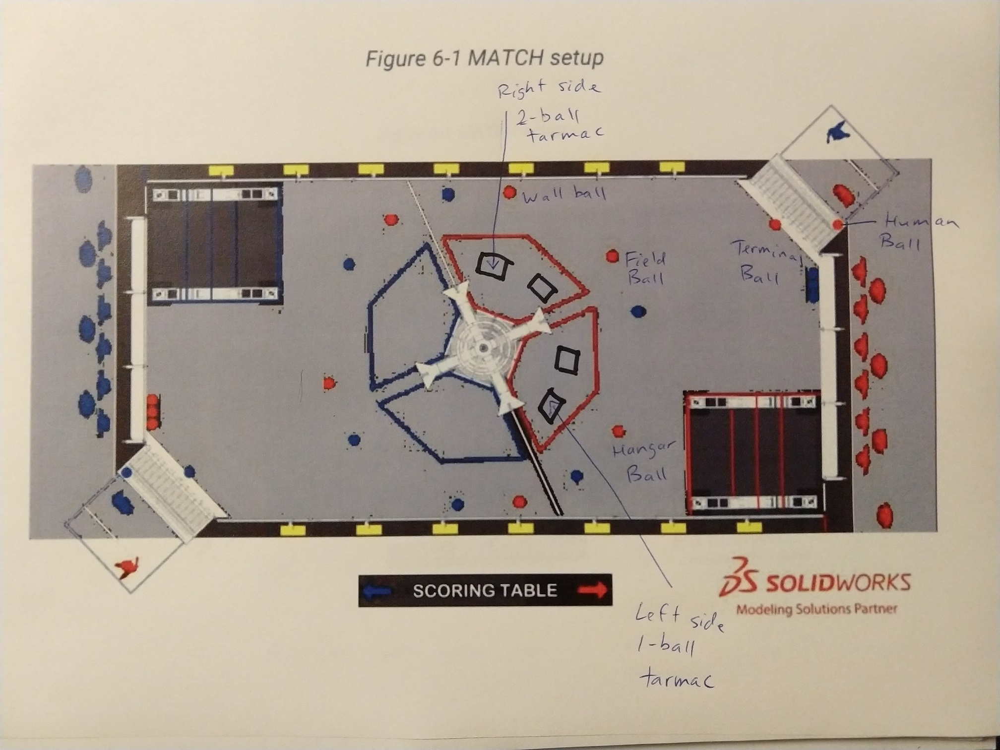

# How to Write Markdown

Some of the *most* **important** markdown tricks.  Preview in vscode with ```Ctrl-Shift-V```.

## Links

[The Outliers website](https://www.theoutliers.org/)

## Lists

### Unordered

- Item one
- Item two

### Ordered

1. Item one
1. Item two

## Code Blocks

```
This is markdown code.  *Italics* **Bold**

# Level 1 Header

## Level 2 Header

[Hyperlink Anchor Text](https://www.theoutliers.org/)

Unordered List
- item
- item

Ordered List
1. item 1
1. item 2



Table|Heading
-----|-------
Cell A | Cell B
```

## Images


## Tables

Column A Heading | Column B Heading
-----------------|-----------------
Column A cell | Column B cell